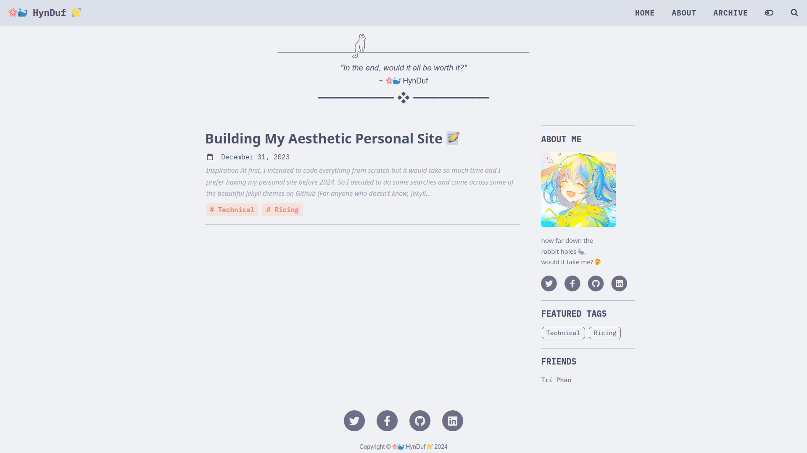
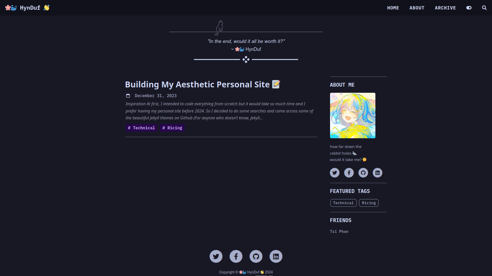
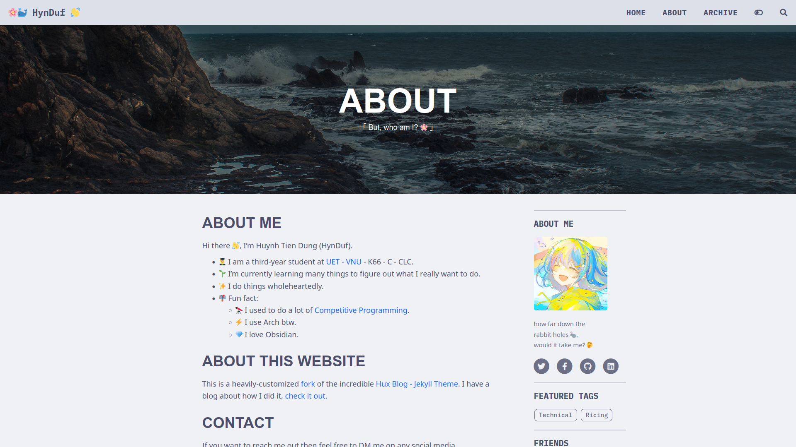
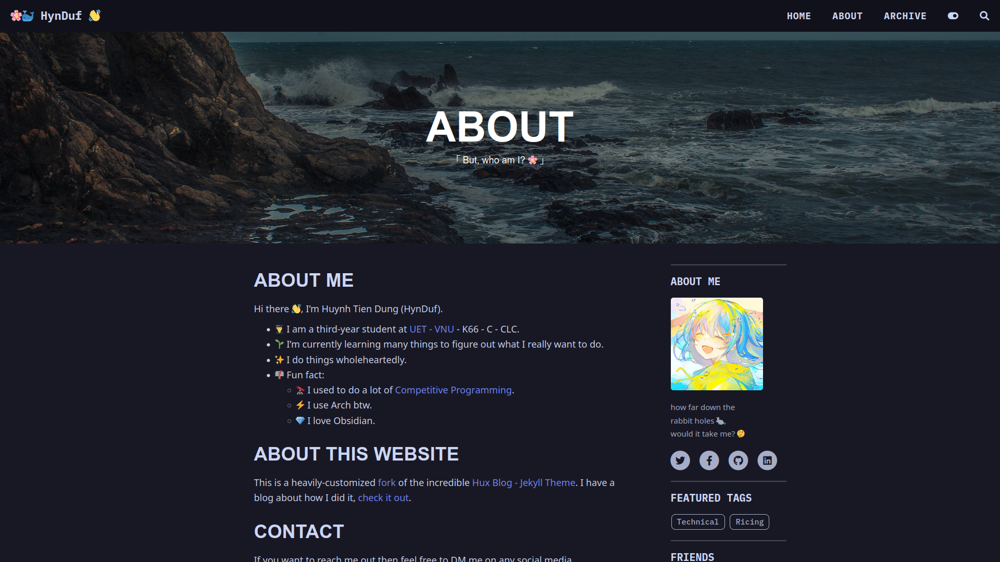
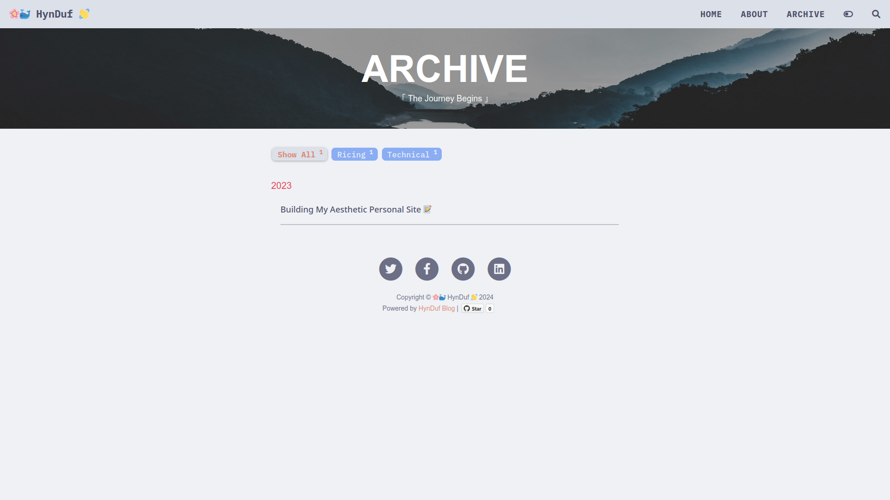
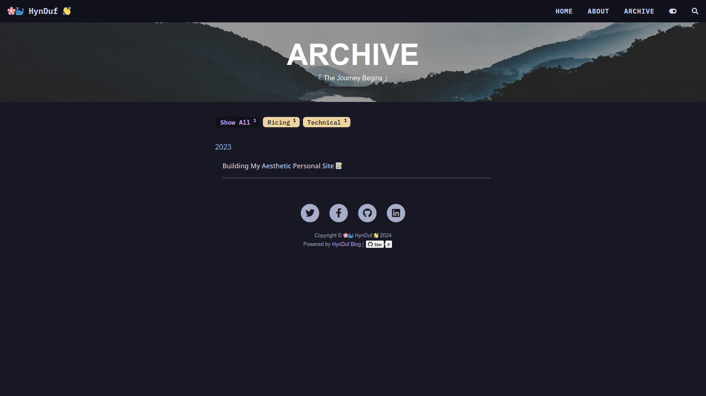
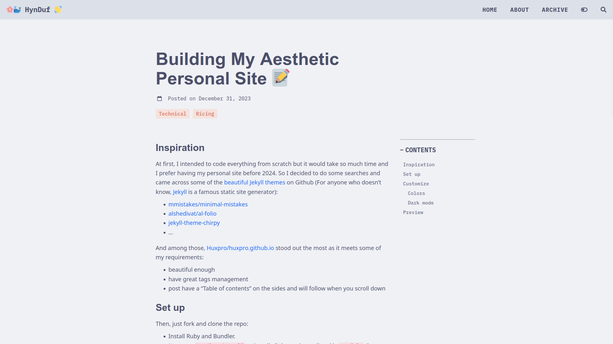
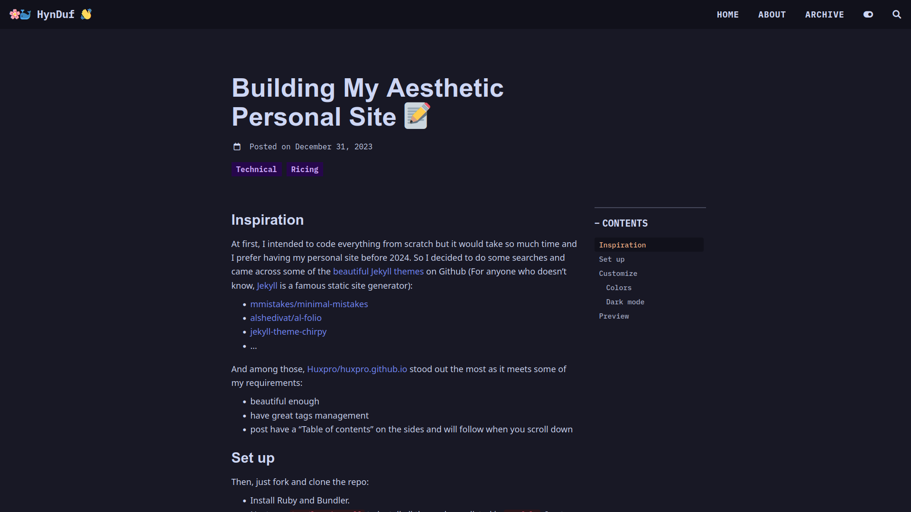

[🌸🐳 HynDuf 👋](https://hynduf.github.io)
================================

	
	

Please read the original [README.md](https://github.com/Huxpro/huxpro.github.io) first to have the full guide.

This is a heavily-customized [fork](https://github.com/HynDuf/hynduf.github.io) of the incredible [Hux Blog - Jekyll Theme](https://github.com/Huxpro/huxpro.github.io). I have a blog about how I did it, [check it out](https://hynduf.github.io/2023/12/31/building-my-aesthetic-personal-site/).

⚠️  Note: Much of the code was added on the fly, so it may appear somewhat messy. I plan to clean it up in the future.
## Customize
The files you typically change are in the directories `_includes`, `_layouts`, and `less`. Most of the new changes I made are in `less/hynduf.less`.

Summarizing the changes I made:
- Home page view (the banner image took up so much space, so I replaced it with some random quotes of my own).
- Added tags of posts on the home page and improved the tags' appearance.
- Changed fonts (see in `variables.less`), increased font size, and reordered many things to my liking.
- Updated Font Awesome v5 (there might be some icons that I didn't use and haven't been migrated to the new version, please create an issue if you find any).
- Github action `jekyll.yml` file that automatically build and deploy the site after committing. You might need to change it if you fork this.
- [Catppuccin color palette](https://github.com/catppuccin/catppuccin)
    - Latte theme and Rosewater accent color for light mode.
    - Mocha theme and Mauve accent color for dark mode.
- Dark mode switcher.

TODOS:
- [ ] **Streamline Multilanguage Option**: Current workflow requires user to change too many things.
- [ ] **Projects** page with grid-like and image preview for projects.
- [ ] **Documentation-like Posts**: It's like a group-of-posts feature (Ex: Mkdocs, Just the docs...). Each post will have a left bar to navigate to other posts in the same group.

## Preview
Here are some previews of the revamped website.

I think that's it. Please feel free to create any issues or contribute to the site. Special thanks to [Hux Blog](https://github.com/Huxpro/huxpro.github.io) for the incredible Jekyll theme, [Catppuccin](https://github.com/catppuccin/catppuccin) for the beautiful color palette, and a big shoutout to myself for having time to waste 😋.
